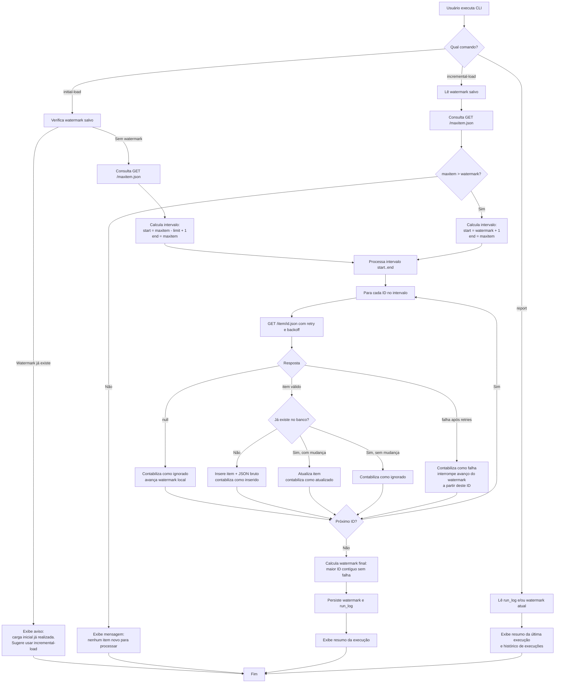

# PRD — Ingestão Incremental do Hacker News

## 1. Visão geral

Este documento descreve os requisitos e o plano de implementação de um processo
de ingestão incremental de itens da API pública do Hacker News (Firebase API).
O sistema consulta a API oficial, persiste os itens em uma base local SQLite e
garante que execuções repetidas não gerem duplicidade de registros, mantendo
um estado incremental (watermark) que controla até qual ponto o processamento
já foi concluído com sucesso.

O escopo é deliberadamente restrito ao que está descrito no desafio: não é
necessário processar todo o histórico do Hacker News, não há testes
automatizados nesta entrega, não há containerização e nenhum commit deve ser
feito antes de revisão humana.

## 2. Sobre o produto

Trata-se de um utilitário de linha de comando (CLI) em Python, executado sob
demanda, que:

- Realiza uma **carga inicial limitada** de itens do Hacker News.
- Realiza **cargas incrementais** subsequentes, buscando apenas itens novos
  desde a última execução bem-sucedida.
- Persiste os itens em um banco **SQLite** local, com chave única por item.
- Gera um **relatório** ao final de cada execução (e permite consultar o
  histórico de execuções).

Não é um serviço contínuo (daemon) nem uma API web — é uma ferramenta de linha
de comando pensada para demonstrar controle de estado, resiliência e clareza
operacional.

## 3. Propósito

Demonstrar, de forma simples e correta, como construir um pipeline de
ingestão incremental e idempotente a partir de uma API pública paginada por
ID sequencial, incluindo:

- Controle de estado (watermark) entre execuções.
- Persistência local sem duplicidade.
- Tratamento de falhas transitórias (timeout, erro de rede) com retries e
  backoff.
- Tratamento de itens ausentes/nulos.
- Relato objetivo do resultado de cada execução.

## 4. Objetivos

1. Permitir a execução de uma carga inicial limitada, configurável por
   quantidade de itens.
2. Permitir execuções incrementais subsequentes que processem apenas o
   intervalo de IDs ainda não processado com sucesso.
3. Garantir que reexecuções não criem registros duplicados (idempotência).
4. Persistir campos consultáveis dos itens e também o JSON bruto retornado
   pela API.
5. Tratar de forma resiliente: itens nulos, timeouts, falhas de rede e falhas
   pontuais por ID, sem interromper o processamento dos demais itens do
   intervalo.
6. Manter o watermark (`last_item_id`) atualizado apenas até o maior ID
   efetivamente processado com sucesso, de forma contígua.
7. Gerar, ao final de cada execução, um resumo com: faixa processada, itens
   consultados, inseridos, atualizados, ignorados, falhas e duração.
8. Documentar em README como executar carga inicial, carga incremental e
   relatório.

## 5. Requisitos funcionais

| ID    | Requisito |
|-------|-----------|
| RF01  | O sistema deve consultar `GET /maxitem.json` para obter o maior ID de item disponível na API no momento da execução. |
| RF02  | O sistema deve permitir uma carga inicial limitada por um parâmetro de quantidade de itens (`--limit`), processando os `N` itens mais recentes em relação ao `maxitem` atual, em ordem crescente de ID. |
| RF03  | O sistema deve permitir uma carga incremental que processe apenas o intervalo de IDs maior que o `last_item_id` salvo (watermark) até o `maxitem` atual. |
| RF04  | Cada item deve ser persistido em SQLite com `id` como chave única, usando operação de upsert (inserir se não existir, atualizar se existir e houver mudança) — nunca duplicar. |
| RF05  | Devem ser persistidos campos estruturados consultáveis (`id`, `type`, `by`, `time`, `title`, `url`, `score`, `descendants`, `parent`, `text`, `deleted`, `dead`) além do JSON bruto original do item. |
| RF06  | Itens que retornam `null` da API (removidos ou inexistentes) devem ser tratados sem interromper o processo, contabilizados como "ignorados". |
| RF07  | Falhas de rede/timeout por item devem ser tratadas com número limitado de tentativas (retries) e backoff exponencial entre elas. |
| RF08  | Falhas por ID (após esgotar as tentativas) devem ser registradas individualmente, sem interromper o processamento dos demais IDs do intervalo. |
| RF09  | O watermark (`last_item_id`) deve avançar apenas até o maior ID a partir do qual todos os itens do intervalo, em sequência a partir do início processado, foram concluídos com sucesso (inserido, atualizado ou ignorado por ser nulo). A primeira falha na sequência limita o avanço do watermark, mesmo que IDs posteriores tenham sido processados com sucesso. |
| RF10  | Ao final de cada execução, o sistema deve gerar um resumo contendo: faixa processada (ID inicial e final), quantidade consultada, inserida, atualizada, ignorada, com falha, e duração total. |
| RF11  | Cada execução deve ser registrada em um histórico de execuções (tabela `run_log`), permitindo consulta posterior. |
| RF12  | Deve existir um comando de relatório que exiba o resumo da última execução e/ou o histórico de execuções armazenado. |
| RF13  | (Opcional) O sistema pode usar `GET /updates.json` para identificar e atualizar itens já existentes que sofreram alteração (ex.: mudança de `score` ou `descendants`), sem que isso seja obrigatório para o funcionamento incremental via `maxitem`. |

### 5.1. Flowchart Mermaid — fluxos de UX (operação via CLI)



## 6. Requisitos não-funcionais

| ID     | Requisito |
|--------|-----------|
| RNF01  | Todo o código-fonte (nomes de módulos, classes, funções, variáveis) deve ser escrito em inglês. |
| RNF02  | Toda saída exibida ao usuário (mensagens de log, resumo, relatório, README) deve estar em português brasileiro. |
| RNF03  | O código Python deve usar aspas simples (`'...'`) de forma consistente. |
| RNF04  | O código deve seguir o padrão PEP 8. |
| RNF05  | O sistema deve ser separado em camadas isoladas por responsabilidade: domínio, infraestrutura, aplicação (casos de uso) e apresentação (CLI). |
| RNF06  | O único banco de dados permitido é o SQLite. |
| RNF07  | Não devem ser criados testes automatizados nesta entrega. |
| RNF08  | Não deve haver containerização (Docker ou similar) nesta entrega. |
| RNF09  | O sistema deve ser idempotente: qualquer reexecução, total ou parcial, não deve gerar registros duplicados. |
| RNF10  | O timeout de requisição HTTP deve ser configurável (com valor padrão razoável). |
| RNF11  | O sistema deve registrar logs estruturados de cada execução (nível, timestamp, mensagem) via módulo `logging` padrão do Python. |
| RNF12  | Nenhum commit deve ser realizado automaticamente; toda alteração deve aguardar revisão humana antes de ser versionada. |
| RNF13  | O código deve ser simples, sem abstrações além do necessário para atender aos requisitos deste PRD. |

## 7. Arquitetura técnica

O projeto segue uma separação em camadas simples (inspirada em arquitetura
hexagonal, sem excesso de abstração), isolando responsabilidades:

```
hacker-news/
├── hn_ingest/
│   ├── config.py                       # Configurações e constantes (URLs, timeout, retries)
│   ├── domain/
│   │   ├── entities.py                 # Entidade Item (dataclass) e enums
│   │   └── repositories.py             # Interfaces (contratos) de persistência
│   ├── infrastructure/
│   │   ├── database.py                 # Conexão SQLite e criação de schema
│   │   ├── http_client.py              # Cliente HTTP com retry/backoff
│   │   ├── sqlite_item_repository.py   # Implementação do repositório de itens
│   │   ├── sqlite_state_repository.py  # Implementação do repositório de estado (watermark)
│   │   └── sqlite_run_log_repository.py# Implementação do repositório de execuções
│   ├── application/
│   │   ├── dto.py                      # RunSummary (resumo da execução)
│   │   ├── process_range_use_case.py   # Lógica central de processamento de um intervalo de IDs
│   │   ├── initial_load_use_case.py    # Orquestra a carga inicial
│   │   ├── incremental_load_use_case.py# Orquestra a carga incremental
│   │   └── report_use_case.py          # Orquestra a geração de relatório
│   └── presentation/
│       └── cli.py                      # Interface de linha de comando (argparse)
├── main.py                             # Ponto de entrada
├── requirements.txt
├── README.md
└── PRD.md
```

**Responsabilidade das camadas:**

- **Domínio**: entidades e contratos (interfaces), sem dependência de
  bibliotecas externas nem de detalhes de implementação.
- **Infraestrutura**: implementações concretas de acesso a dados (SQLite) e
  de acesso à API do Hacker News (HTTP), incluindo resiliência (retry/backoff).
- **Aplicação**: casos de uso que orquestram domínio e infraestrutura,
  concentrando as regras de negócio (cálculo de intervalo, cálculo de
  watermark, contabilização do resumo).
- **Apresentação**: CLI que traduz comandos do usuário em chamadas aos casos
  de uso e formata a saída em português brasileiro.

### 7.1. Modelo de dados (SQLite)

**Tabela `items`**

| Coluna       | Tipo    | Descrição |
|--------------|---------|-----------|
| id           | INTEGER | Chave primária — ID do item na API do HN. |
| type         | TEXT    | Tipo do item (`story`, `comment`, `job`, `poll`, etc.). |
| by           | TEXT    | Autor do item. |
| time         | INTEGER | Timestamp Unix de criação. |
| title        | TEXT    | Título (quando aplicável). |
| url          | TEXT    | URL (quando aplicável). |
| score        | INTEGER | Pontuação (quando aplicável). |
| descendants  | INTEGER | Quantidade de comentários (quando aplicável). |
| parent       | INTEGER | ID do item pai (quando aplicável). |
| text         | TEXT    | Texto (quando aplicável). |
| deleted      | INTEGER | Flag booleana (0/1). |
| dead         | INTEGER | Flag booleana (0/1). |
| raw_json     | TEXT    | JSON bruto original retornado pela API. |
| inserted_at  | TEXT    | Timestamp de inserção do registro. |
| updated_at   | TEXT    | Timestamp da última atualização do registro. |

**Tabela `run_state`**

| Coluna       | Tipo    | Descrição |
|--------------|---------|-----------|
| key          | TEXT    | Chave do estado (ex.: `last_item_id`). Chave primária. |
| value        | TEXT    | Valor do estado. |
| updated_at   | TEXT    | Timestamp da última atualização. |

**Tabela `run_log`**

| Coluna           | Tipo    | Descrição |
|------------------|---------|-----------|
| id               | INTEGER | Chave primária autoincremento. |
| run_type         | TEXT    | `initial` ou `incremental`. |
| range_start      | INTEGER | ID inicial do intervalo processado. |
| range_end        | INTEGER | ID final do intervalo processado. |
| queried_count    | INTEGER | Quantidade de itens consultados na API. |
| inserted_count   | INTEGER | Quantidade de itens inseridos. |
| updated_count    | INTEGER | Quantidade de itens atualizados. |
| skipped_count    | INTEGER | Quantidade de itens ignorados (nulos ou sem mudança). |
| failed_count     | INTEGER | Quantidade de itens com falha. |
| duration_seconds | REAL    | Duração total da execução, em segundos. |
| started_at       | TEXT    | Timestamp de início. |
| finished_at      | TEXT    | Timestamp de término. |

### 7.2. Stack

| Categoria            | Escolha | Justificativa |
|----------------------|---------|----------------|
| Linguagem            | Python 3.11+ | Requisito do desafio; tipagem via `dataclasses` e `typing`. |
| Cliente HTTP         | `requests` | Biblioteca simples e amplamente utilizada para chamadas HTTP síncronas. |
| Banco de dados       | `sqlite3` (biblioteca padrão) | Único banco permitido pelo desafio; dispensa dependências externas. |
| CLI                  | `argparse` (biblioteca padrão) | Suficiente para os três comandos exigidos, sem dependência extra. |
| Logging              | `logging` (biblioteca padrão) | Atende ao requisito de logs estruturados sem dependência extra. |
| Retry/backoff        | Implementação manual (sem dependência extra) | Mantém o código simples e explícito, conforme exigido pelo desafio. |
| Gerenciamento de deps| `requirements.txt` + `venv` | Simplicidade, sem necessidade de ferramentas adicionais. |

## 8. Critérios de aceite

1. **Idempotência**: executar o mesmo comando (`initial-load` ou
   `incremental-load`) mais de uma vez não deve criar registros duplicados na
   tabela `items` (chave única por `id`).
2. **Consulta apenas do intervalo novo**: uma segunda execução de
   `incremental-load` deve consultar apenas o intervalo de IDs entre o
   watermark salvo e o `maxitem` atual — ou, caso não haja itens novos, deve
   encerrar sem realizar chamadas de item, informando o motivo.
3. **Watermark correto**: o estado (`last_item_id`) deve ser atualizado
   somente até o maior ID processado com sucesso de forma contígua a partir
   do início do intervalo — nunca ultrapassando um ID com falha não
   resolvida.
4. **Persistência completa**: cada item salvo deve conter tanto os campos
   estruturados consultáveis quanto o JSON bruto original.
5. **Resiliência**: itens nulos, timeouts e falhas de rede não devem
   interromper o processamento dos demais IDs do intervalo.
6. **Relatório**: cada execução deve exibir um resumo com faixa processada,
   consultados, inseridos, atualizados, ignorados, falhas e duração; o
   comando de relatório deve permitir consultar essas informações
   posteriormente.
7. **Documentação**: o README deve explicar claramente como executar a carga
   inicial, a carga incremental e o relatório.

## 9. Risco e mitigações

| Risco | Impacto | Mitigação |
|-------|---------|-----------|
| Instabilidade ou lentidão da API pública do HN | Falhas ou lentidão nas execuções | Timeout configurável, retries limitados com backoff exponencial por item. |
| Alto volume de itens (histórico com dezenas de milhões de IDs) | Execução muito longa ou custosa | Carga inicial limitada por parâmetro (`--limit`); não é requisito processar todo o histórico. |
| Itens nulos ou removidos pela API | Erros não tratados durante o parsing | Tratamento explícito de resposta `null`, contabilizado como "ignorado" sem interromper o processo. |
| Falha pontual em um ID no meio do intervalo | Bloqueio do avanço do watermark ou perda de dados já obtidos | Processamento continua para os demais IDs do intervalo; watermark avança apenas até o maior ID contíguo sem falha, garantindo reprocessamento seguro (idempotente) na próxima execução. |
| Interrupção abrupta da execução (ex.: processo encerrado no meio) | Estado inconsistente | Watermark e `run_log` são persistidos apenas ao final do processamento do intervalo, evitando estado parcialmente escrito. |
| Execuções concorrentes do mesmo processo | Condição de corrida na escrita do SQLite | Ferramenta projetada para execução única por vez (não concorrente); SQLite serializa escritas, e o risco é aceito e documentado como limitação conhecida, dado o escopo do desafio. |
| Crescimento do banco pelo campo `raw_json` | Aumento do tamanho do arquivo SQLite | Aceito como necessário, pois preservar o JSON bruto é requisito explícito do desafio. |

## 10. Lista de tarefas

> Convenção: cada subtarefa é marcada como `- [ ]` (pendente) ou `- [x]`
> (concluída). Nenhuma tarefa de teste ou containerização foi incluída,
> conforme observação explícita do desafio.

### Sprint 1 — Fundamentos, configuração e camada de domínio

- [ ] **1.1. Estrutura inicial do projeto**
  - [ ] 1.1.1. Criar a estrutura de diretórios `hn_ingest/` com os
        subpacotes `domain/`, `infrastructure/`, `application/` e
        `presentation/`, cada um com `__init__.py`.
  - [ ] 1.1.2. Criar `requirements.txt` contendo apenas a dependência
        `requests`.
  - [ ] 1.1.3. Criar `main.py` na raiz como ponto de entrada, que apenas
        importa e invoca a função principal da CLI (`presentation/cli.py`).
  - [ ] 1.1.4. Configurar `.gitignore` básico (arquivo `.db` local,
        `__pycache__`, ambiente virtual).

- [ ] **1.2. Módulo de configuração (`hn_ingest/config.py`)**
  - [ ] 1.2.1. Definir constante `BASE_URL` da API do Hacker News
        (`https://hacker-news.firebaseio.com/v0/`).
  - [ ] 1.2.2. Definir constantes de resiliência: `REQUEST_TIMEOUT_SECONDS`,
        `MAX_RETRIES`, `BACKOFF_BASE_SECONDS`.
  - [ ] 1.2.3. Definir constante `DEFAULT_INITIAL_LOAD_LIMIT` (quantidade
        padrão de itens da carga inicial).
  - [ ] 1.2.4. Definir caminho padrão do arquivo SQLite (`DATABASE_PATH`).
  - [ ] 1.2.5. Permitir sobrescrita das constantes acima via variáveis de
        ambiente, com fallback para os valores padrão.

- [ ] **1.3. Entidades de domínio (`hn_ingest/domain/entities.py`)**
  - [ ] 1.3.1. Criar `dataclass Item` com os campos: `id`, `type`, `by`,
        `time`, `title`, `url`, `score`, `descendants`, `parent`, `text`,
        `deleted`, `dead`, `raw_json`.
  - [ ] 1.3.2. Implementar método de fábrica `Item.from_api_response(data:
        dict)` que constrói a entidade a partir do JSON retornado pela API,
        preenchendo `raw_json` com o JSON serializado original.
  - [ ] 1.3.3. Criar `dataclass RunSummary` com os campos: `run_type`,
        `range_start`, `range_end`, `queried_count`, `inserted_count`,
        `updated_count`, `skipped_count`, `failed_count`,
        `duration_seconds`, `started_at`, `finished_at`.
  - [ ] 1.3.4. Criar enum `ProcessOutcome` com os valores `INSERTED`,
        `UPDATED`, `SKIPPED`, `FAILED`, representando o resultado do
        processamento de um único ID.

- [ ] **1.4. Contratos de repositório (`hn_ingest/domain/repositories.py`)**
  - [ ] 1.4.1. Definir interface abstrata `ItemRepository` com os métodos
        `upsert(item: Item) -> ProcessOutcome` e `exists(item_id: int) ->
        bool`.
  - [ ] 1.4.2. Definir interface abstrata `StateRepository` com os métodos
        `get_last_item_id() -> int | None` e `set_last_item_id(value: int) ->
        None`.
  - [ ] 1.4.3. Definir interface abstrata `RunLogRepository` com os métodos
        `save(summary: RunSummary) -> None` e `get_latest() -> RunSummary |
        None` e `list_all() -> list[RunSummary]`.

### Sprint 2 — Camada de infraestrutura (persistência e cliente HTTP)

- [ ] **2.1. Bootstrap do banco (`hn_ingest/infrastructure/database.py`)**
  - [ ] 2.1.1. Implementar função `get_connection()` que retorna uma conexão
        `sqlite3` configurada (`row_factory`, `PRAGMA foreign_keys`).
  - [ ] 2.1.2. Implementar função `initialize_schema(connection)` que cria as
        tabelas `items`, `run_state` e `run_log` caso não existam
        (`CREATE TABLE IF NOT EXISTS`).
  - [ ] 2.1.3. Adicionar índice em `items.type` e `items.time` para consultas
        futuras (campos consultáveis).

- [ ] **2.2. Cliente HTTP (`hn_ingest/infrastructure/http_client.py`)**
  - [ ] 2.2.1. Implementar classe `HackerNewsClient` com método
        `get_max_item_id() -> int`, chamando `GET /maxitem.json`.
  - [ ] 2.2.2. Implementar método `get_item(item_id: int) -> dict | None`,
        chamando `GET /item/{id}.json`, retornando `None` quando a API
        responde `null`.
  - [ ] 2.2.3. Implementar lógica interna de retry com backoff exponencial
        (`MAX_RETRIES` tentativas, espera `BACKOFF_BASE_SECONDS * 2 **
        tentativa`), aplicada a erros de timeout e de conexão.
  - [ ] 2.2.4. Tratar exaustão das tentativas levantando exceção específica
        `ItemFetchError`, capturada posteriormente pelo caso de uso.
  - [ ] 2.2.5. Aplicar `REQUEST_TIMEOUT_SECONDS` em todas as chamadas HTTP.
  - [ ] 2.2.6. (Opcional/RF13) Implementar método `get_updates() -> dict`
        chamando `GET /updates.json`, retornando a lista de `items`
        alterados.

- [ ] **2.3. Repositório de itens (`sqlite_item_repository.py`)**
  - [ ] 2.3.1. Implementar `SqliteItemRepository` que recebe uma conexão
        SQLite no construtor.
  - [ ] 2.3.2. Implementar `upsert(item)` usando
        `INSERT ... ON CONFLICT(id) DO UPDATE ...`, comparando campos
        relevantes antes de decidir entre `INSERTED`, `UPDATED` ou
        `SKIPPED` (sem mudança).
  - [ ] 2.3.3. Garantir preenchimento de `inserted_at` na criação e
        `updated_at` a cada upsert.
  - [ ] 2.3.4. Implementar `exists(item_id)` com `SELECT 1 FROM items WHERE
        id = ?`.

- [ ] **2.4. Repositório de estado (`sqlite_state_repository.py`)**
  - [ ] 2.4.1. Implementar `SqliteStateRepository` com tabela `run_state`
        (chave/valor).
  - [ ] 2.4.2. Implementar `get_last_item_id()` retornando `None` quando a
        chave `last_item_id` não existir (primeira execução).
  - [ ] 2.4.3. Implementar `set_last_item_id(value)` com upsert da chave
        `last_item_id` e atualização de `updated_at`.

- [ ] **2.5. Repositório de execuções (`sqlite_run_log_repository.py`)**
  - [ ] 2.5.1. Implementar `SqliteRunLogRepository.save(summary)` inserindo
        uma linha na tabela `run_log`.
  - [ ] 2.5.2. Implementar `get_latest()` retornando o registro mais recente
        por `finished_at`.
  - [ ] 2.5.3. Implementar `list_all()` retornando todas as execuções
        ordenadas da mais recente para a mais antiga.

### Sprint 3 — Camada de aplicação (casos de uso)

- [ ] **3.1. Processamento central de intervalo
      (`process_range_use_case.py`)**
  - [ ] 3.1.1. Implementar função/classe `process_range(start_id, end_id,
        http_client, item_repository)` que itera sequencialmente do
        `start_id` ao `end_id`.
  - [ ] 3.1.2. Para cada ID: consultar item via `http_client.get_item`,
        tratando `None` como item ignorado (nulo).
  - [ ] 3.1.3. Para cada item válido: converter para entidade `Item` e
        delegar ao `item_repository.upsert`, coletando o `ProcessOutcome`.
  - [ ] 3.1.4. Capturar `ItemFetchError` por ID, registrar o ID como
        `FAILED` no log da execução, e continuar o loop sem interromper os
        próximos IDs.
  - [ ] 3.1.5. Acumular contadores: `queried_count`, `inserted_count`,
        `updated_count`, `skipped_count`, `failed_count`.
  - [ ] 3.1.6. Calcular o `last_success_id`: o maior ID, a partir do
        `start_id`, tal que todos os IDs entre `start_id` e ele não tenham
        resultado em `FAILED` (interrompe o avanço no primeiro `FAILED`
        encontrado, mesmo que IDs posteriores tenham sido processados).
  - [ ] 3.1.7. Retornar um objeto de resultado contendo os contadores e o
        `last_success_id` calculado.

- [ ] **3.2. Caso de uso de carga inicial (`initial_load_use_case.py`)**
  - [ ] 3.2.1. Verificar, via `StateRepository`, se já existe
        `last_item_id` salvo; se existir, retornar indicação de que a carga
        inicial já foi realizada (sem processar nada).
  - [ ] 3.2.2. Consultar `http_client.get_max_item_id()` para obter o
        `maxitem` atual.
  - [ ] 3.2.3. Calcular `start_id = max(1, maxitem - limit + 1)` e
        `end_id = maxitem`.
  - [ ] 3.2.4. Registrar `started_at` (timestamp) antes de iniciar o
        processamento.
  - [ ] 3.2.5. Invocar `process_range` com o intervalo calculado.
  - [ ] 3.2.6. Persistir `last_item_id = last_success_id` via
        `StateRepository`, apenas se `last_success_id >= start_id`.
  - [ ] 3.2.7. Montar `RunSummary` (tipo `initial`) com os contadores,
        `range_start`, `range_end`, `duration_seconds` e `finished_at`.
  - [ ] 3.2.8. Persistir o `RunSummary` via `RunLogRepository`.
  - [ ] 3.2.9. Retornar o `RunSummary` para exibição pela camada de
        apresentação.

- [ ] **3.3. Caso de uso de carga incremental
      (`incremental_load_use_case.py`)**
  - [ ] 3.3.1. Ler `last_item_id` salvo via `StateRepository`; se não
        existir, retornar indicação de que é necessário rodar a carga
        inicial primeiro.
  - [ ] 3.3.2. Consultar `http_client.get_max_item_id()` para obter o
        `maxitem` atual.
  - [ ] 3.3.3. Se `maxitem <= last_item_id`, retornar resultado indicando
        que não há itens novos, sem realizar chamadas de item.
  - [ ] 3.3.4. Calcular `start_id = last_item_id + 1` e `end_id = maxitem`.
  - [ ] 3.3.5. Reaproveitar `process_range` para processar o intervalo.
  - [ ] 3.3.6. Persistir o novo `last_item_id` apenas se o processamento
        avançou (`last_success_id >= start_id`).
  - [ ] 3.3.7. Montar e persistir `RunSummary` (tipo `incremental`),
        seguindo a mesma estrutura da carga inicial.
  - [ ] 3.3.8. Retornar o `RunSummary` (ou a indicação de "nenhum item
        novo") para exibição pela camada de apresentação.

- [ ] **3.4. Caso de uso de relatório (`report_use_case.py`)**
  - [ ] 3.4.1. Implementar `get_latest_summary()`, delegando a
        `RunLogRepository.get_latest()`.
  - [ ] 3.4.2. Implementar `get_history()`, delegando a
        `RunLogRepository.list_all()`.
  - [ ] 3.4.3. Implementar `get_current_state()`, retornando o
        `last_item_id` atual via `StateRepository`.

### Sprint 4 — Camada de apresentação (CLI) e documentação

- [ ] **4.1. Interface de linha de comando (`presentation/cli.py`)**
  - [ ] 4.1.1. Configurar `argparse` com subcomandos: `initial-load`,
        `incremental-load` e `report`.
  - [ ] 4.1.2. Adicionar argumento `--limit` (inteiro, opcional, com padrão
        `DEFAULT_INITIAL_LOAD_LIMIT`) ao subcomando `initial-load`.
  - [ ] 4.1.3. Adicionar argumento opcional `--history` ao subcomando
        `report`, para exibir todas as execuções em vez de apenas a última.
  - [ ] 4.1.4. Implementar montagem das dependências (conexão SQLite,
        repositórios, cliente HTTP) e injeção nos casos de uso, a partir de
        `main.py`/`cli.py`.
  - [ ] 4.1.5. Configurar `logging` básico (nível `INFO`, formato com
        timestamp) no início da execução da CLI.

- [ ] **4.2. Formatação de saída em português brasileiro**
  - [ ] 4.2.1. Implementar função de formatação do `RunSummary` em texto
        legível (faixa processada, consultados, inseridos, atualizados,
        ignorados, falhas, duração), em português.
  - [ ] 4.2.2. Implementar mensagens específicas para os casos de borda:
        carga inicial já realizada, nenhum item novo no incremental, carga
        inicial ainda não realizada ao tentar rodar incremental.
  - [ ] 4.2.3. Implementar formatação do histórico de execuções para o
        comando `report --history` (tabela simples em texto).
  - [ ] 4.2.4. Garantir código de saída (`exit code`) diferente de zero em
        caso de erro não tratado, com mensagem amigável em português.

- [ ] **4.3. Revisão de padronização do código**
  - [ ] 4.3.1. Revisar todo o código-fonte garantindo uso de aspas simples
        de forma consistente.
  - [ ] 4.3.2. Revisar aderência ao PEP 8 (nomes, espaçamento, imports,
        comprimento de linha).
  - [ ] 4.3.3. Revisar se todo identificador (módulo, classe, função,
        variável) está em inglês e todo texto exibido ao usuário está em
        português brasileiro.
  - [ ] 4.3.4. Revisar docstrings das classes e funções públicas, escritas
        em português brasileiro, explicando apenas o não óbvio.

- [ ] **4.4. README**
  - [ ] 4.4.1. Escrever seção de visão geral do projeto e requisitos
        (Python 3.11+, `pip install -r requirements.txt`).
  - [ ] 4.4.2. Escrever instruções de execução da carga inicial (exemplo de
        comando com `--limit`).
  - [ ] 4.4.3. Escrever instruções de execução da carga incremental
        (exemplo de comando).
  - [ ] 4.4.4. Escrever instruções de execução do relatório (última
        execução e histórico).
  - [ ] 4.4.5. Documentar a estrutura de camadas do projeto e a localização
        do arquivo SQLite gerado.
  - [ ] 4.4.6. Documentar a política de watermark (avanço apenas até o
        maior ID contíguo sem falha) e o comportamento de idempotência.
  - [ ] 4.4.7. Documentar limitações conhecidas (execução única por vez,
        sem testes automatizados, sem containerização), conforme escopo do
        desafio.

- [ ] **4.5. Validação manual final**
  - [ ] 4.5.1. Executar `initial-load` com um `--limit` pequeno e confirmar
        no banco a quantidade de itens inseridos e o resumo exibido.
  - [ ] 4.5.2. Reexecutar `initial-load` e confirmar que o sistema informa
        que a carga inicial já foi realizada, sem duplicar registros.
  - [ ] 4.5.3. Executar `incremental-load` e confirmar que apenas o
        intervalo novo é consultado.
  - [ ] 4.5.4. Reexecutar `incremental-load` imediatamente em seguida e
        confirmar comportamento de "nenhum item novo" quando não houver
        itens além do `maxitem` já processado.
  - [ ] 4.5.5. Executar `report` e `report --history` e validar que os
        dados exibidos condizem com as execuções realizadas.
  - [ ] 4.5.6. Validar manualmente o tratamento de um ID inexistente/nulo
        dentro do intervalo processado.
